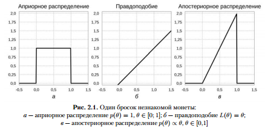

<!-- slide -->
## Введение

<!-- slide vertical=true -->### Что такое DL?
<!-- slide vertical=true -->

#### Термин
Начнем с простого: DL -- это термин. 
<!-- slide vertical=true -->

##### Археология

- 1986 -- Рина Дехтер "Learning while searching in constraint-satisfaction problems" <!-- .element: class="fragment" data-fragment-index="1" -->
- ... <!-- .element: class="fragment" data-fragment-index="1" -->
- 2000 -- Айзербенг и коллеги. Multi-Valued and Universal Binary Neurons: Theory, Learning and Applications <!-- .element: class="fragment" data-fragment-index="2" -->
- ... <!-- .element: class="fragment" data-fragment-index="2" -->
- 2006 -- Хинтон и коллеги "A Fast Learning Algorithm for Deep Belief Nets" <!-- .element: class="fragment" data-fragment-index="3" -->
- ... <!-- .element: class="fragment" data-fragment-index="3" -->
- 2020 <!-- .element: class="fragment" data-fragment-index="4" -->

<cite>[Schmidhuber][DL_term]</cite>

[DL_term]: https://plus.google.com/100849856540000067209/posts/7N6z251w2Wd?pid=6127540521703625346&oid=100849856540000067209

<!-- slide vertical=true -->
##### Еще термины
Когда мы сталкиваемся с термином DL, мы достаточно быстро можем встретиться с терминами:
- Machine Learning <!-- .element: class="fragment" data-fragment-index="1" -->
- Pattern Recognition <!-- .element: class="fragment" data-fragment-index="2" -->
- Artificial Intelligence <!-- .element: class="fragment" data-fragment-index="3" -->
- Neural Networks <!-- .element: class="fragment" data-fragment-index="4" -->
- ... <!-- .element: class="fragment" data-fragment-index="3" -->

<!-- slide vertical=true -->
##### Еще археология

- 1943 -- Маккахолох и Питтс -- Neural Networks -- <cite>[NN_term]</cite> <!-- .element: class="fragment" data-fragment-index="1" -->
- 1955 -- Маккартни Джон -- Artificial Intelligence -- <cite> [historyofinformation.com][AI_term]</cite> <!-- .element: class="fragment" data-fragment-index="2" -->
- 1959 -- Артур Самуэль -- Machine Learning -- <cite>[Wikipedia][ML_term]</cite> <!-- .element: class="fragment" data-fragment-index="3" -->
- 1967? -- ??? -- Pattern Recognition <!-- .element: class="fragment" data-fragment-index="4" -->

[NN_Term]: http://nautil.us/issue/21/information/the-man-who-tried-to-redeem-the-world-with-logic
[AI_Term]: http://www.historyofinformation.com/expanded.php?id=946
[ML_Term]: https://en.wikipedia.org/wiki/Timeline_of_machine_learning

<!-- slide vertical=true -->
#### 
В некотором роде можно сказать, что DL появилось раньше, чем AI и раньше чем ML.

TODO: доформулировать здесь

Рассмотрим как эти вещи связаны. 

Strong AI, Weak AI
AI is the new Electricity
...

<!-- slide vertical=true -->
#### Deep Learning -- это Learning
##### Обучение
Что вообще пытались сделать люди, напридумывавшие эти термины? 

##### Дартмут 1957
> Some work has been done on simulating neuron nets on our automatic calculator.

> The machine is provided with input and output channels and an internal means of providing varied output responses to inputs in such a way that the machine may be "trained" by a "trial and error" process to acquire one of a range of input-output functions. -- <cite>[Dartmouth Summer Research Proposal][Dartmouth_Proposal]</cite> 

[Dartmouth_Proposal]: http://www-formal.stanford.edu/jmc/history/dartmouth/dartmouth.html

<!-- slide vertical=true -->

Придумывали алгоритмы для таких вот задач. 

Но вообще алгоритмы тема не новая -- зачем еще термины?

А в том что создать алгоритм -- очень сложно. 

<!-- slide vertical=true -->

##### Индуктивная машина

http://raysolomonoff.com/publications/indinf56.pdf

<!-- slide vertical=true -->
##### Problem Solving ~ Learning ~ Extrapolation

http://raysolomonoff.com/dartmouth/notebook/dart56ipl_0117.pdf

<!-- slide vertical=true -->
##### Экстраполяция -- модель?

##### Кто прекрасно владеет индукцией?

Статистика

#### ML -- это компьютеры и learning

##### Что получается в результате обучения?

<!-- slide vertical=true -->
#### Модель

> Человек — существо бескрылое, двуногое, с плоскими ногтями, восприимчивое к знанию, основанному на рассуждениях 
-- <cite>[Платон][Plato]</cite>

[Plato]: https://ru.wikipedia.org/wiki/%D0%9F%D0%BB%D0%B0%D1%82%D0%BE%D0%BD#%D0%A7%D0%B5%D0%BB%D0%BE%D0%B2%D0%B5%D0%BA 

картинки моделей:
фешн-модель
F = ma (график)

$$ F = m*a$$
модель машинки
карта
линейная регрессия 
нейросеть (модель модели)
матрица весов

среди разнообразных моделей выделяют, например, такие:
- список моделей
https://en.wikipedia.org/wiki/Model

нас интересуют математические модели
особый их подкласс -- статистические модели

> All models are wrong but some are useful
-- <cite>[Джордж Бокс][Box]</cite>

[Box]: https://en.wikipedia.org/wiki/All_models_are_wrong

определение и разница со статистическими моделями http://www.fharrell.com/post/stat-ml/

<!-- slide vertical=true -->
#### Современные определения машинного обучения
https://stackoverflow.com/questions/2620343/what-is-machine-learning
https://machinelearningmastery.com/what-is-machine-learning/
https://www.quora.com/What-is-machine-learning-in-laymans-terms-1?redirected_qid=1155077
https://www.quora.com/What-is-deep-learning-Why-is-this-a-growing-trend-in-machine-learning-Why-not-use-SVMs
список определений и картинки https://www.techemergence.com/what-is-machine-learning/

мл -- про компьютеры -- это часть computer science

Например, сложно  написать программу, которая распознает объекты под разных освещением. 

мл-подход создает программы иным образом

на математическом уровне мл про аппроксимацию и оптимизацию
про аппроксимацию и про оптимизацию об этом поговорим позже

<!-- slide vertical=true -->
Моделью алгоритма $a$ называется параметрическое семейство функций $g: X \rightarrow Y или g(x, \theta)$, где $\theta \in \Theta$ - параметры в пространстве параметров.
Пример: 
В задачах с $m$-признаками $f_j(x), j = 1,\dots,m$
используются линейные модели с
$\theta = (\theta_1 ,\dots,\theta_m) : g (x,θ) = \displaystyle\sum_{j=1}^{m}  θ_j f_j(x)$
Процесс подбора оптимальной функции $g$ и оптимального параметра $θ$ по обучающей выборке называют настройкой (fitting, tuning) или обучением (training) алгоритма $a$
http://www.levvu.narod.ru/Machine_Learning_LTU_1.pdf

LEARNING = REPRESENTATION +
EVALUATION + OPTIMIZATION https://homes.cs.washington.edu/~pedrod/papers/cacm12.pdf

<!-- slide vertical=true -->
## Популярное определение

> Говорят, что программа обучается на опыте $E$ относительно класса задач $T$ в смысле меры качества $L$, если при решении задачи $T$ качество, измеряемое мерой $L$, возрастает при демонстрации нового опыта $E$. -- <cite>[Mitchell]</cite>

[Mitchell]: ...

<!-- slide vertical=true -->
## Выделяют следующие задачи $T$

- supervised (с учителем)
- unsupervised (без учителя)
- reinforcement (с подкреплением)
- active (активное)

<!-- slide vertical=true -->
## Примеры

#### примеры supervised:

- цена квартиры
- кликнет ли пользователь на рекламу
- болен ли человек
- что изображено на фотографии
- перевод текста 
- позиция других машин

#### примеры unsupervised:

- нахождение похожих покупателей
- уменьшение размерности данных

#### примеры reinforcement:

- игры
- перемещение робота в пространстве

<!-- slide vertical=true -->

<!-- slide vertical=true -->
так же данные (т.е. опыт $E$ из определения Митчелла) так же классифицируют:

## простой пример (линейная регрессия)
опишем задачу
как будем решать? 
iid -- почему?

<!-- slide  -->
## Неопределенности
Важный и популярный взгляд на мл -- это вероятностная интерпретация и в целом байесовский взгляд на мир. 

МЛ - наука о том, как делать выводы на основе данных. Делать точные вывода практически никогда не представляется возможным. Поэтому во всех наших выводах содержится доля неопределенности.  

С неопределенностью работает -- теория вероятности. 

Поэтому так выходит, что мл основана на тервере. 

<!-- slide vertical=true -->
### Рекап тервера
- Дискретные случайные величины с конечным или счетным набором исходов. Сумма вероятностей исходов равна 1. Например, бросание кубика
- Одномерные непрерывные случайные величины. Набор исходов -- вещественная прямая $\mathbb{R}$. Вероятности отдельных исходов -- *функция распределения* $F(a) = p(x < a)$. Производная функции распределения -- *плотность распределения* $p(x) = \frac{\dF}{\dx}$. Вместо суммы теперь интеграл: $\int_{-\infty}^{\infty} p(x)dx = F(\infty) - F(-\infty) = 1$
- Совместная вероятность -- вероятность одновременного наступления двух событий $p(x, y)$. Например, 2 кубика
- Если $p(x, y) = p(x) p(y)$, то величины называются *независимыми*.
- Маргинализация -- получение из совместной вероятности вероятность исхода одной из случайных величин
$p(x) = \sum_y p(x, y)$ для дискретных величин
$p(x) = \int_Y p(x, y)dy$ для непрерывных величин
- Условная вероятность $p(x | y)$-- вероятность наступления одного события, если известно, что произошло другое: $p (x|y) = \frac{p(x, y)}{p(y)}$
- Если $p (x, y | z) = p(x|z) p(y|z)$, то говорят, что $x$ и $y$ *условно независимы* при условии $z$

TODO: добавить ссылки на рекапы и курсы

<!-- slide vertical=true -->
### Иллюстрация -- Парадокс Монти Холла 
Есть 2 стула... 

TODO: Описание

3 двери: $x_1$, $x_2$, $x_3$
$p(x_1) = p(x_2) = p(x_3) = 1/3$
Если открыл до выбора (например, $x_3$)
$p(x_1| x_3 = 0) = p(x_2 | x_3 = 0) = 1/2$

События "какую из пустых открыть" и "стоит ли там автомобиль" становятся зависимыми. Предположим, что вы выбрали первую дверь ($x_1$), а ведущий открыл дверь $y$. Допустим автомобиль действительно за дверь $x_1$. Тогда совместные вероятности разложатся так:
$p(x1 = 1, y = 2) = $

<!-- slide vertical=true -->
### Формула Байеса
По определению условной вероятности: 
$p(x,y) = p(y|x)p(x) = p(x|y)p(y)$

$$ p(y | x) = \frac{p(x|y)p(y)}{p(x)} = \frac{p(x|y)p(y)}{\sum_{y' \in Y} p(x|y')p(y')}

теорема Байеса.

<!-- slide vertical=true -->
### Пояснение 
Формула Байеса позволяет переоценивать наши априорные представления ($p(y)$) о мире на основе данных, которые мы получили в виде наблюдений ($p(x | y)$). И в качестве вывода получая новое представление $p(y | x)$

TODO: учебник с собачками

Формула баеса

Пример медицинский ( задача и вычисления) -- 
t -- результат теста
d -- наличие болезни
$p(t=+) = p(t=+|d=+)p(d=+) + p(t=+|d=-)p(d=-)$

TODO: 
$p(d = + | t = +) = \frac{p(t=+|d=+)p(d=+)}{p(t=+)} = \frac{p(t=+|d=+)p(d=+)}{p(t=+|d=+)p(d=+) + p(t=+|d=-)p(d=-)} = \frac{0,95 * 0,01}{0,95 * 0,01 + 0,05 * 0,99} = 0,16$

https://logic.pdmi.ras.ru/~sergey/teaching/mlkfu14/01-intro.pdf

<!-- slide vertical=true -->
### *Вероятностный вывод* (Probabilistic inference) 
Подобные задачи называются задачами вероятностного вывода, или байесовского вывода. 
Это так же пример, *обратная задача* теорвера. В обратном задачи мы по поведеию строить вероятностную модель. Соответственно бывают *прямые задачи* теорвера. Это когда мы по описанию вероятностного процесса предсказываем поведение. 

Например, моя студентка для дипломной работы делала опрос программистов. В том числе она спрашивала про стаж. А затем просила выполнили задание. Можно увидеть тут прямую задачу: на основе модели (стажа) оценить насколько хорошо они выполнят задачу (поведение). Но некоторые вероятно отвечали нечестно на вопрос про стаж. На комиссии у нее спросили не посчитала какая вероятность что человек, которые выполнил задание соврал про стаж. Т.е. по поведению получить модель. 
 
TODO: (Подсчет Монти холла) 
https://memepedia.ru/wp-content/uploads/2018/01/%D1%88%D0%B0%D0%B1%D0%BB%D0%BE%D0%BD-%D0%B4%D0%B2%D0%B5%D1%80%D0%B8.jpg

<!-- slide vertical=true -->
Сравнение с фреквентисткой
Баесовский подход -- расширение пропозициональной логики

Байесовский вывод можно рассматривать как обобщение классической булевой логики. 
Например, классическое правило Modus Ponens

$\frac{A, A \arrow B}{A & B}$
$\frac{p(A), p(B|A)}{pA&B}$

<!-- slide vertical=true -->
Формула баеса в мл-виде и ее члены
$$p(\theta | D) = \frac{p(\theta)p(theta|D)}{p(D)} = 
\frac{p(\theta)p(\theta)p(D|\theta)}{\int_{\theta \in \Theta}p(D|\theta)p(\theta)d\theta}$$

$p(\theta)$ -- априорная вероятность (prior probability);
$p(D|\theta)$ -- правдоподобие (likelihood)
$p(\theta | D)$ -- апостериорная вероятность (posterior probability);
$p(D) = \int p(D|\theta)p(\theta)d\theta$ -- вероятность данных (evidence);

<!-- slide vertical=true -->
Многие задачи машинного обучения имеют вид некоторой модели с параметрами \theta; задача состоит в том, чтобы по данным D подобрать параметры \theta наилучшим образом. 

<!-- slide vertical=true -->
В классической статистике ищут гипотезу максимального правдоподобия (maximun likelihood, ML)
$\theta_{ML} = \operatorname*{argmax_\theta} p(D|\theta)$
В байесовском подходе и современном машинном обучении апостериорное распределение 
p(\theta | D) \sim p(D|\theta)p(\theta) 
А возможно максимальную апостериорную гипотезу (maximum a posteriori hypothesis, MAP)

$\theta_{MAP} = $\operatorname*{argmax_\theta} p(\theta|D) = \operatorname*{argmax_\theta} p(D|\theta)p(\theta)$

<!-- slide vertical=true -->
Разница между максимизации ML и MAP на примере с монеткой:
$ p(h, t | \theta) = \theta^h(1 - \theta)^t $, где
h -- количество решек
t -- количество орлов
$\theta$ -- вероятность выпадения решки

А если мы подбросили 1 раз, то из MLE выходит, что монетка будет выпадать теперь всегда той же стороной.

В реальности у нас есть какие-то представления о монетке. Формализацией этих представлений является априорное распределение $p(\theta)$. Умножаясь на правдоподобие, оно сглаживает результат. 

<!-- slide vertical=true -->
Например, если мы ничего не знаем о монетке, то наша представления можно формализовать в виде равномерного распределения. 

Тогда получим: 

<!-- slide vertical=true -->
Или мы можем предположить, что монетка "честная" и априорное распределение похоже на острый колокол с максимумом в 1/2. В качестве формализации такого представления мы можем, например, взять бета-распределение

$\Beta(\theta; \alpha, \beta) = \frac{1}{B(\alpha, \beta)}\theta^{\alpha - 1}(1 - \theta)^{\beta - 1}$, где $B(\alpha, \beta) = \frac{\Gamma(\alpha), \Gamma(\beta)}{\Gamma(\alpha + \beta)}$
А $\Gamma$ -- это расширение факториала, для натуральных чисел: $\Gamma(a) = (a - 1)!.$

<!-- slide vertical=true -->
В таком выборе есть большой смысла. Бета-распределение похоже на функцию правдоподобия монетки. И если их перемножить и нормировать, то получится опять бета-распределение.

TODO:
Beta(θ; α; β) × p(h; t j θ) \sim θ^{α−1}(1 − θ)^{β−1}θh (1 − θ)^t =
= θ^{α+h−1} (1 − θ)^{β+t−1} \sim Beta(θ; α + h; β + t):
Такие априорные распределения зовутся *сопряженными*.

И идея тут в том, что если мы в качестве априорного распределения задаем сопряженное, то баесовский вывод упрощается -- сводится к подправлению параметров приора. 

<!-- slide vertical=true -->

<!-- slide vertical=true -->

В общем, когда мы делаем баесовский вывод в МЛ, кроме правдоподобия, мы должны выбрать приор на всех возможных значениях параметров. А затем посчитать MAP.
Теорема Байеса позволяет перейти от $p(\theta|D)$, котороче часто непонятно как посчитать к подсчету $p(D|\theta)$, определяемого в модели и выбранного нами $p(\theta)$

<!-- slide vertical=true -->
### Предсказательное распределение
Зачем вообще нам параметры? Потому что мы хотим предсказывать. 
И следовательно нас чаще интересует даже не $p(\theta | D)$, а *предсказательное распределение* (predictive distribution) $p(y | D)$

$$ p(y|D) = \int_\Theta p(y | \theta) p(\theta | D) d\theta \sim \int_\Theta p(y | \theta) p(\theta) p(D| \theta) d\theta$$, 
где $\theta \in \Theta$

TODO: дописать формулу
Например, для монетки с равномерным приором мы получим:
$ p(h|D) = \int_{-\infiny}^\infiny \theta $

Найти предсказательное распределение сложно даже для простых моделей. А более-менее сложных моделей используется методы сложные приближенного байесовского вывода. 

<!-- slide vertical=true -->
### Задача оптимизации
Впрочем, для нейросетей никто и не ищет предсказательное распределение. А ищут или MAP или MLE.

$\theta_{ML} = \operatorname*{argmax_\theta} p(D|\theta)$

$\theta_{MAP} = \operatorname*{argmax_\theta} p(\theta|D) = \operatorname*{argmax_\theta} p(D|\theta)p(\theta)$

<!-- slide vertical=true -->
Обычно в ML подразумевается, что [каждый пример из данных порожден независимо](https://en.wikipedia.org/wiki/Independent_and_identically_distributed_random_variables), и таким образом правдоподобие по определению независимости сводиться к произведению:
$p (D| \theta) = \prod_{d \in D} p(d|\theta)$

<!-- slide vertical=true -->
Так же часто от максимизации произведению переход к максимизации суммы логарифмов:

$\theta_{MAP} = $\operatorname*{argmax_\theta} p(\theta|D) = \operatorname*{argmax_\theta} p(D|\theta)p(\theta) =  \operatorname*{argmax_\theta} p(\theta)\prod_{d \in D} p(d|\theta) =  \operatorname*{argmax_\theta} (\log p(\theta) + \sum_{d \in D} \log p(d|\theta) $

Нейронную сеть тоже является одной из таких моделей. 

TODO: Краткий итог

<!-- slide  -->
## линейная регрессия или логистическая

https://logic.pdmi.ras.ru/~sergey/teaching/dlharbour17/02-regression.pdf

https://www.cs.toronto.edu/~frossard/post/linear_regression/

https://github.com/Cleo-Stanford-CS/CS229_Notes/blob/master/lectures/cs229-notes1.pdf

<!-- slide vertical=true -->
Давайте посмотрим на каком-нибудь примере. Возьмем самую классическую задачу: линейной регрессии.

$y(x) = \sum_{i=0}^{m} x_i\omega_i = \mathbf{x}^T \omega$, где
$ \mathbf{x} = (1, x_1, \dots, x_p)$

- Если смотреть на линейную регрессию по-байесовски, то нам нужно ввести вероятностные предположения. 
Основное предположение, что ошибка в данных (шум) распределен  нормально с центров в нуле, т.е. 

$t = y(x, \omega) + \epsilon$, где $\epsilon \sim  \mathcal{N}(0, \sigma^2)$

- Т.е. $p(t | \mathbb{x}, \omega, \sigma^2) = \mathcal{N}(t | y(\mathbb(x), \omega), \sigma^2)$

- для набора данных, который мы считаем i.i.d 
 $p(t | \mathbb{x}, \omega, \sigma^2) = \prod_{n=1}^N \mathcal{N}(t | y(\mathbb(x), \omega), \sigma^2)$
- как выглядит плотность нормального распределения
$p (x| \mu, \sigma) = \frac{1}{\sigma\sqrt{2\pi}}e^{-\frac{(x - \mu)^2}{2\sigma^2}}$
- подставим в формулу правдоподобия и прологарифмируем:
$ \ln p(t | \omega, \sigma^2) = -frac{N}{2}\ln(2\pi\sigma^2) - \frac{1}{2\sigma^2}\sum_{n=1}^N(t_n - \omega^T x_n)^2$

- при максимизации отбросим слагаемые, независящие от \omega и получим среднеквадратичную ошибку.

<!-- slide vertical=true -->

### Регуляризация

- Возьмем теперь в качестве параметрической функции полином:
$y(x) = \sum_{j=1}^{d} x^j\omega_j = (1 x x^2 \dots x^d)^T \omega $

TODO: исправить

Если посмотреть на коэффициенты получившихся моделей:
f0(x) = − 2,2393;
f1(x) = − 2,6617 + 1,8775x;
f2(x) = − 2,2528 + 3,4604x − 3,0603x2;
f3(x) = − 2,2937 + 3,5898x − 2,6538x2 − 0,5639x3;
f8(x) = − 2,2324 + 2,2326x + 6,2543x2 + 15,5996x3 − 239,9751x4+
+ 322,8516x5 + 621,0952x6 − 1478,6505x7 + 750,9032x8;
f9(x) = − 2,22 + 2,01x + 4,88x2 + 31,13x3 − 230,31x4+
+ 103,72x5 + 869,22x6 − 966,67x7 − 319,31x8 + 505,64x9

- Можно отметить, что коэффициенты очень большие. 
- Вспомним, про априорные распределения 
- Предположим, что коэффициенты тоже должны быть распределены нормально: $p(\omega) = \mathcal{N}(\omega | \sigma_0, \sum_0)$

- Чтобы посчитать апостериорное распределение нам нужно как обычно умножить априорное на правдоподобие:
$p(t | \mathbb{x}, \omega, \sigma^2)p(\omega) = \mathcal{N}(\omega | \sigma_0, \sum_0) \prod_{n=1}^N \mathcal{N}(t | y(\mathbb(x), \omega), \sigma^2)

- После ряда преобразований и привычного логарифмирования мы получим следующий логарифм правдоподобия:
$\ln p(\omega | t) = -\frac{1}{2\sigma^2}\sum_{n=1}^N(t_n - \omega^T x_n)^2 - \frac{\alpha}{2} \omega^T\omega + const$

- Если убрать "лишнее", то можно увидеть в этом формулу т.н. гребневой регрессии (L2-регуляризация)

- Так же можно обратить внимание, что логарифм апостериорного распределения тоже нормальное распределение. Т.е. при фиксированнй дисперсии и неизвестном среднем нормальное распределение является *самосопряженным*

<!-- slide vertical=true -->
Классификация, логистическая регрессия, софтмакс-регрессия?

https://github.com/Cleo-Stanford-CS/CS229_Notes/blob/master/lectures/cs229-notes1.pdf

<!-- slide  -->

## градиентный спуск
Мы говорили о том, что нам нужно максимизировать что-то. Или скорее минимизировать некую функцию ошибки. 
Встает вопрос: "а как же это делать?" На этот вопрос отвечает раздел математики под названием оптимизация.
В совсем простых случаях можно минимум посчитать прямо. 
Но в большинстве случаев это невозможно сделать. И тут на помощь приходит метод градиентного спуска. 

TODO: подробнее

http://wiki.fast.ai/index.php/Gradient_Descent
numpy https://www.youtube.com/watch?v=5u0jaA3qAGk&feature=youtu.be
https://github.com/fastai/courses/blob/master/deeplearning1/excel/graddesc.xlsm

numpy https://scipython.com/blog/visualizing-the-gradient-descent-method/
animation https://gist.github.com/peterroelants/679410641a15b715a8a36ec39388516f?short_path=f0f5089#file-gradient_descent_animation-ipynb

https://jed-ai.github.io/py1_gd_animation/

поверхность https://arxiv.org/pdf/1712.09913.pdf

TODO: вставить картину/анимацию
TODO: код? 
TODO: код в циклах и векторизированный код в numpy?

Допустим у нас есть набор данных $D$, 
состоящий из пар $(x, y)$, где $x$ - признаки, $y$ - правильный ответ
модель с весами $\theta$
предсказание $\hat{y} = f(x, \theta)$
и функция ошибки $E(y, \hat{y})$

функция ошибок на всем наборе данных
$E(\theta) = \sum_{(x, y) \in D} E(f(x, \theta), y)$

а градиентный спуск будет выглядет так:
$\theta_t = \theta_{t-1} - \eta\nablaE(\theta_{t-1}) = \theta_{t-1} - \eta \sum_{(x, y) in D} \nabla E(f(x, \theta_{t-1}), y)$
<!-- slide vertical=true -->

### стохастический градиентный спуск
- Но если набор данных большой, как и бывает на практике, то вместо подсчета градиента на всем множестве, делают подсчет только на одном примере и после этого обновляют. 
$\theta_t = \theta_{t-1} - \eta \nabla E(f(x, \theta_{t-1}), y)$

- На самом деле, на практике стараются обновлять веса не после каждого примера, а после группы примеров. Группу называют мини-батчем или просто батчем. А градиентный спуск соответственно *стохастическим градиентным спуском по мини-батчам*

<!-- slide vertical=true -->
## регрессия как граф

Давайте посмотрим на примере линейной регрессии. 

Для начала представить регрессию в графовом представлении

TODO: рассмотреть регрессию как граф и прийти к бекпропу

Такую представления чего-то в наше время называют графом вычислений.

TODO: код для сгд (нужно ли сначала в цикле, а потом векторно?!)

<!-- slide vertical=true -->
## backpropagation

Рассмотрим более сложный граф: 

TODO: взять из cs231n 

https://google-developers.appspot.com/machine-learning/crash-course/backprop-scroll/
https://www.reddit.com/r/MachineLearning/comments/4lf8n1/naomi_saphra_on_twitter_what_idiot_called_it_deep/
https://www.youtube.com/watch?v=Ilg3gGewQ5U

<!-- slide vertical=true -->
TODO: шутка про бекпропаганду. 

<!-- slide vertical=true -->
### Промежуточный итог

У нас есть какие-то пары данных 
Мы предполагаем, что эти пары как-то связаны
Форму связи не знаем, но ее так же как-то предполагаем
В соответствии с этими предположениями мы выбираем какую-то параметрическую функцию (модель) и соответственно лосс
(мультилейбл -- бернулли распределение
регрессия -- L2 гауссово распределение 
или понимания природу данных -- мы можем выбрать другой лосс для регрессии)

Дальше мы подбираем параметры, так чтобы наша модель как-то можно точнее делала соответсвия между парами 
Для этого зачастую мы максимизируем т.н. правдоподобие (MLE) этой модели
Так же мы сделать какие-то вероятностные предположения о параметрах нашей модели
Тогда мы будем максимизировать апостериорную вероятность (MAP)
Максимизируем мы зачастую итеративно, методом градиентного спуска
Для того чтобы можно было применить градиентый спуск -- модель должна быть дифференцируемой

### Фреймворки для автоматического дифференцирования

PyTorch -- фреймворк для autodiff
https://github.com/hunkim/PyTorchZeroToAll/blob/master/06_logistic_regression.py

<!-- slide  -->
## 
НН -- это сложная композиция простых дифференцируемых по входам и по выходом функций, подразумевающая настройку параметров методом обратного распространенния ошибка. 

собственно логрес -- это такая нейронная сеть. простая и ограниченная в своих возможностях. например, XOR-проблема.
чтобы решить мы можем добавить еще...
давайте добавим еще один похожий юнит...
TODO: как тут лучше описать?

TODO: 

### Функции активации
Сигмоид в контексте нн называют функцией активации.
А могут ли быть другие функции?
Ступенчая функция
Гиперболический тангенс
ReLU
(почему ReLU лучше)
...

TODO: графики, особенности

### Стекуем несколько юнитов
TODO: написать
Нелинейность
Глубокие сети

TODO: Интуиция о нелинейности

Интерактивный пример: http://playground.tensorflow.org 

### Революция Deep Learning
Принято выделять несколько вещей, которые привели к тому, что иногда называют революцией.

- научились лучше обучать
    - другие функции активации
    - проблемы затухания градиента
    - инициализация весов

- рост вычислительных мощность:
    - GPU 

- больше данных

### Инициализация весов
TODO: Xavier, He

### Регуляризация
weight decay
dropout
batch-normalization

## Разные архитектуры-слои
Помним о размерностях 
Количество операций?
Обучаемый/нет?
Как идет бекверд 

### Сверточные слои

Во-первых, поймем как выглядит в компьютере изображение

Во-вторых, почему сверточные. Название происходит от термина "свертка".

Примеры в экселе: https://towardsdatascience.com/building-a-deep-neural-net-in-google-sheets-49cdaf466da0
Интерактивное примеры сверток http://setosa.io/ev/image-kernels/

Можно представить как много маленьких сеток, которые последовательно проходят по изображению. 

-- <cite>[Deep Neural Networks for Object Detection][Nikolenko]</cite>

[Nikolenko]: https://assets.ctfassets.net/oxjq45e8ilak/6orwcDmhDqoo6KiEMeGEsq/63f60eb63e6f903ec0ed149723183b8e/Nikolenko_ObjectDetection.pdf

### Pooling (подвыборка)
TODO: 

### Типичная архитектура сверточной сети (convolutional neural network, CNN)

### Рекурентные
Feedback ◦ Deconvolutional networks o Bi - directional ◦ Deep Boltzmann Machines, stacked autoencoders o Sequence based
◦
RNNs, LSTMs 
http://uvadlc.github.io/lectures/lecture1.pdf

https://upload.wikimedia.org/wikipedia/commons/5/55/%D0%90%D1%80%D1%85%D0%B8%D1%82%D0%B5%D0%BA%D1%82%D1%83%D1%80%D0%B0_%D1%81%D0%B2%D0%B5%D1%80%D1%82%D0%BE%D1%87%D0%BD%D0%BE%D0%B9_%D0%BD%D0%B5%D0%B9%D1%80%D0%BE%D0%BD%D0%BD%D0%BE%D0%B9_%D1%81%D0%B5%D1%82%D0%B8.png

## Питорч

- https://yadi.sk/i/O3mQ76u43So3h9
- https://github.com/yandexdataschool/Practical_DL/blob/master/week02_autodiff/seminar_pytorch.ipynb
- Кашницкий
- дебаг
https://github.com/yandexdataschool/Practical_DL/blob/master/week03_convnets/how_to_shoot_yourself_in_the_foot_with_cnn.ipynb

https://github.com/keon/pytorch-exercises
https://github.com/hunkim/PyTorchZeroToAll/